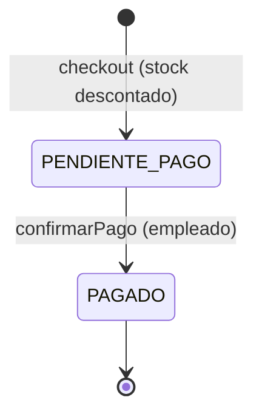

# Estados de pago de una venta

Este documento describe el ciclo de vida del pago de una venta en el minimarket, el flujo manual disponible hoy y la extension futura.

## Estados de una venta


| Campo        | Valores                         | Descripcion                          |
| ------------ | ------------------------------- | ------------------------------------ |
| `estadoPago` | `PENDIENTE_PAGO`, `PAGADO`      | Estado del cobro de la venta         |
| `metodoPago` | `EFECTIVO`, `DEBITO`, `CREDITO` | Medio de pago elegido por el cliente |


**Importante:** actualmente, el `estadoPago` es independiente del descuento de stock. Al concretar el checkout, el stock se rebaja de inmediato aunque el pago siga pendiente.

## Flujo manual disponible hoy




### 1. Checkout del carrito (cliente o cualquier usuario autenticado)

```http
POST /api/carrito/checkout
Authorization: Bearer <token>
Content-Type: application/json

{ "metodoPago": "DEBITO" }
```

- Lee el carrito del usuario autenticado.
- Revalida stock y crea una `Venta` en `PENDIENTE_PAGO`.
- Descuenta inventario via `VentaService`.
- Invoca `NotificationPaymentProcessor` (stub: no cobra, deja pendiente).
- Vacia el carrito del usuario.

### 2. Confirmacion manual de pago (personal de tienda)

```http
POST /api/ventas/{id}/confirmar-pago
Authorization: Bearer <token-empleado>
```

- Solo `EMPLEADO`, `GERENTE` o `ADMIN`.
- Cambia `estadoPago` de `PENDIENTE_PAGO` a `PAGADO`.
- No modifica stock (ya fue descontado en el checkout).

## Respuestas de error relevantes


| Situacion          | HTTP | Ejemplo                                                                   |
| ------------------ | ---- | ------------------------------------------------------------------------- |
| Carrito vacio      | 422  | `{ "error": "No hay productos en el carrito" }`                           |
| Stock insuficiente | 422  | `{ "error": "...", "producto": "...", "disponible": 2, "solicitado": 5 }` |
| Venta ya pagada    | 422  | `{ "error": "La venta ya fue pagada" }`                                   |


## Extension futura recomendada (fuera de scope)

1. **Medio de pago real:** nueva implementacion de `PaymentProcessor` (ej. `StripePaymentProcessor` o Webpay) que marque `PAGADO` automaticamente al recibir un webhook, reemplazando la confirmacion manual para debito/credito.
2. **Notificacion real:** enviar email o push al cliente desde `NotificationPaymentProcessor` con instrucciones de pago segun el `metodoPago` elegido.
3. **Confirmacion en efectivo:** mantener `POST /api/ventas/{id}/confirmar-pago` para ventas en efectivo hasta integrar caja registradora.

