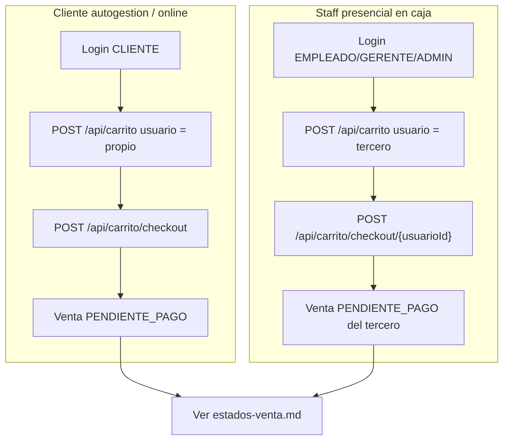
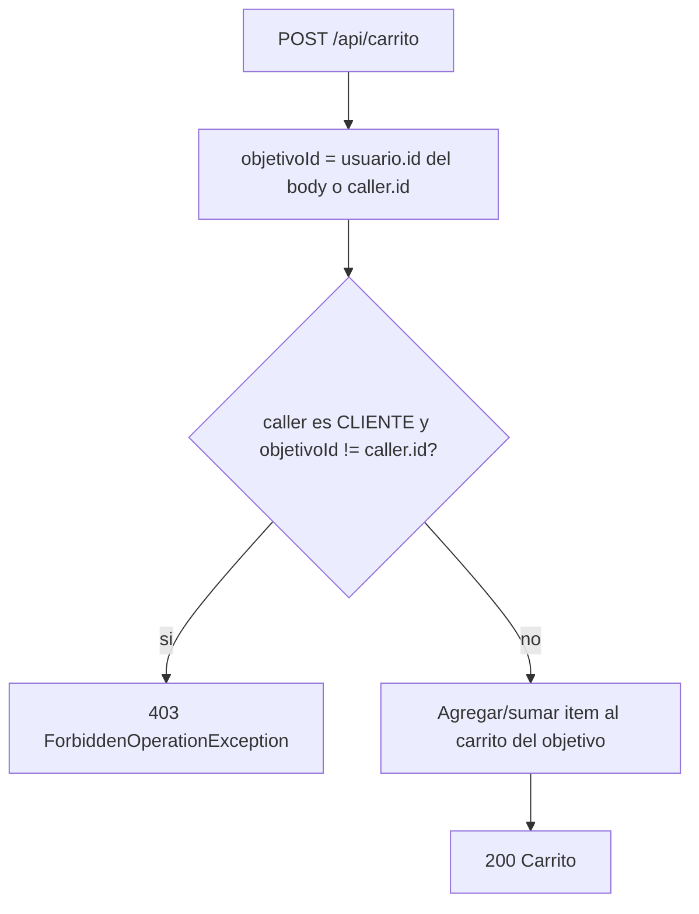

# Logica de negocio del carrito

Este documento describe el dominio del carrito de compras, los permisos por rol y los dos caminos de venta (presencial y autogestion). **Complementa** [estados-venta.md](estados-venta.md), que cubre el ciclo de pago (`PENDIENTE_PAGO` / `PAGADO`), `confirmar-pago` y errores de cobro.

## Dominio del carrito

- **Un carrito por usuario**: modelo cabecera/detalle (`Carrito` + `ItemCarrito`).
- **Unificacion de items**: si el mismo producto se agrega dos veces, se suma la cantidad en el mismo item (no se duplican filas).
- **Stock acumulado**: al agregar, se valida que la cantidad total solicitada no supere el stock disponible (422 con detalle si no alcanza).
- **Ciclo**: agregar items al carrito -> checkout -> venta en `PENDIENTE_PAGO`. Tras el checkout, ver [estados-venta.md](estados-venta.md) para el ciclo de pago.

## Roles y permisos

| Rol | Ver carritos | Agregar items | Checkout propio | Checkout de terceros |
|-----|--------------|---------------|-----------------|----------------------|
| CLIENTE | Solo el propio | Solo al propio | Si | No (403) |
| EMPLEADO | Todos (`/todos`, `/{id}`) | A cualquier usuario | Si (propio) | Si (`/checkout/{usuarioId}`) |
| GERENTE | Todos | A cualquier usuario | Si (propio) | Si |
| ADMIN | Todos | A cualquier usuario | Si (propio) | Si |

### Validacion de propiedad al agregar

Al hacer `POST /api/carrito`, el body puede incluir un `usuario` destino opcional:

```json
{
  "usuario": { "id": 2 },
  "producto": { "id": 1 },
  "cantidad": 1
}
```

- Si `usuario` se omite, el destino es el usuario autenticado (token JWT).
- Si el caller es **CLIENTE** y `usuario.id` no coincide con su propio id -> **403 Forbidden**.
- Si el caller es **STAFF** (EMPLEADO, GERENTE, ADMIN), puede apuntar a cualquier `usuario.id`.

## Flujos por tipo de usuario



## Decision de autorizacion al agregar



## Por que dos caminos de checkout

### Staff agrega y hace checkout de terceros (presencialidad)

En un minimarket fisico, un **cajero o empleado** arma el carrito del cliente en el mostrador y concreta la venta. El cliente puede no usar la app; el staff opera sobre su carrito mediante `usuario.id` en el body y `POST /api/carrito/checkout/{usuarioId}`.

### Cliente hace checkout propio (autogestion / online)

Un cliente puede armar su carrito y pagar solo con `POST /api/carrito/checkout` (sin `usuarioId` en la URL). Esto habilita **kioscos de autoservicio** o una futura **tienda online** donde el usuario no depende del personal.

### Nucleo compartido

Ambos caminos delegan en `checkoutCarritoDe(usuario, metodoPago)`: mismas reglas de stock, misma creacion de `Venta` y mismo vaciado del carrito. No se duplica logica de negocio.

## Endpoints del carrito

| Metodo | Path | Rol | Descripcion |
|--------|------|-----|-------------|
| GET | `/api/carrito` | CLIENTE, ADMIN | Carrito del usuario autenticado |
| GET | `/api/carrito/todos` | EMPLEADO, GERENTE, ADMIN | Todos los carritos activos |
| GET | `/api/carrito/{id}` | EMPLEADO, GERENTE, ADMIN | Carrito por id |
| POST | `/api/carrito` | CLIENTE, EMPLEADO, GERENTE, ADMIN | Agregar/sumar item (validacion de propiedad en servicio) |
| POST | `/api/carrito/checkout` | Autenticado | Checkout del carrito propio |
| POST | `/api/carrito/checkout/{usuarioId}` | EMPLEADO, GERENTE, ADMIN | Checkout del carrito de un tercero |
| DELETE | `/api/carrito/items/{productoId}` | CLIENTE, ADMIN | Quitar producto del carrito propio |
| DELETE | `/api/carrito` | CLIENTE, ADMIN | Vaciar carrito propio |

## Errores relevantes del carrito

| Situacion | HTTP | Ejemplo |
|-----------|------|---------|
| Cliente intenta modificar carrito ajeno | 403 | `{ "error": "Un cliente solo puede modificar su propio carrito" }` |
| Stock insuficiente al agregar | 422 | Ver formato en [estados-venta.md](estados-venta.md) |
| Carrito vacio en checkout | 422 | `{ "error": "No hay productos en el carrito" }` |
